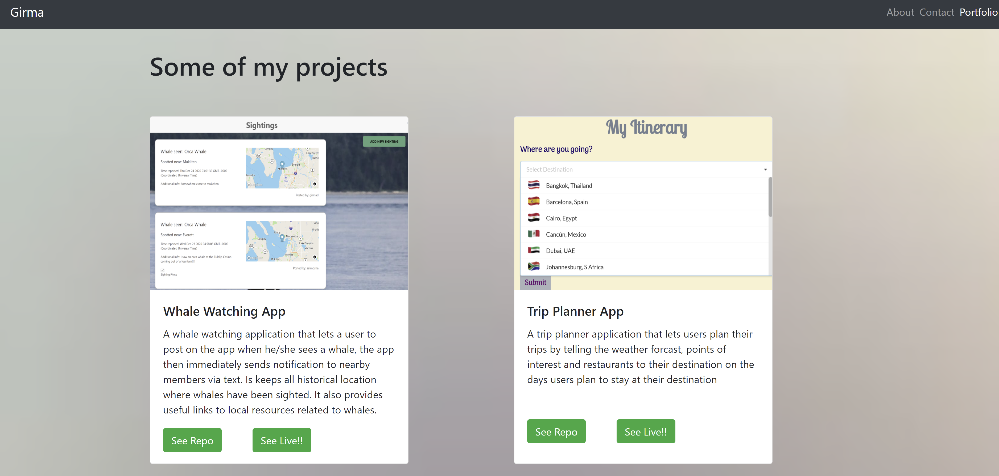

# React Portfolio

* View the [Github Repo](https://github.com/girmaD/react-portfolio)
* View the [Deployed App link](https://girmad.github.io/react-portfolio/)

## Description
  This is my portfolio completely redone using react. It uses useState, UseEffect, and react Router hooks to make it look the way it does.
    

## Table Of Contents 
* [Installation Instructions](#Installation-Instructions)
* [How To Use The App](#How-To-Use-The-App)
* [Contributing Guidelines](#Contributing-Guidelines)
* [Test Information](#Test-Information)
* [License](#License)
* [Questions](#Questions)

## Installation Instructions

 * fork and use it.
 * Don't forget to install all the modules this app depends on.
 * npm i -> will install all the dependecies

## How To Use The App
- The app shows my introductory about page, contact page and portfolio page.
- links to my linkedIn and github are provided in the footer section.

Here is a screen shot of the about/Home page

A screen shot of my project portfolio page
 

## Contributing Guidelines
 * contact me on the email provided below

## Test Information
  * No test specified

## License

 * MIT

## Questions

Should you have any questions about this project,
  * you can reach me through email: [girma.derib@gmail.com](mailto:girma.derib@gmail.com) 
  * or visit my [Github Profile](https://github.com/girmaD) for more information.
